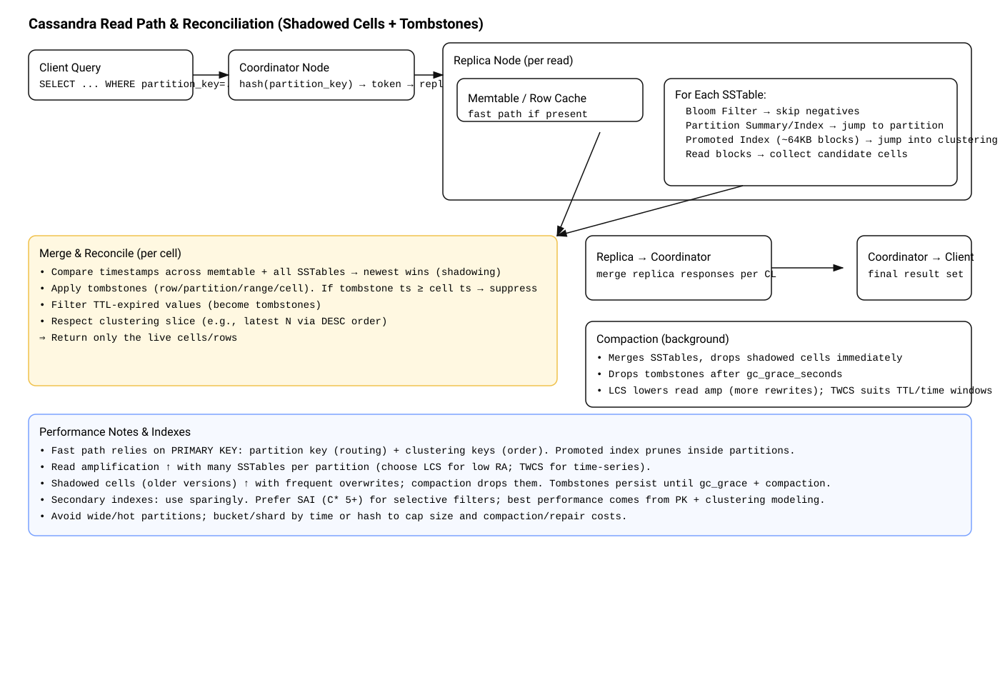
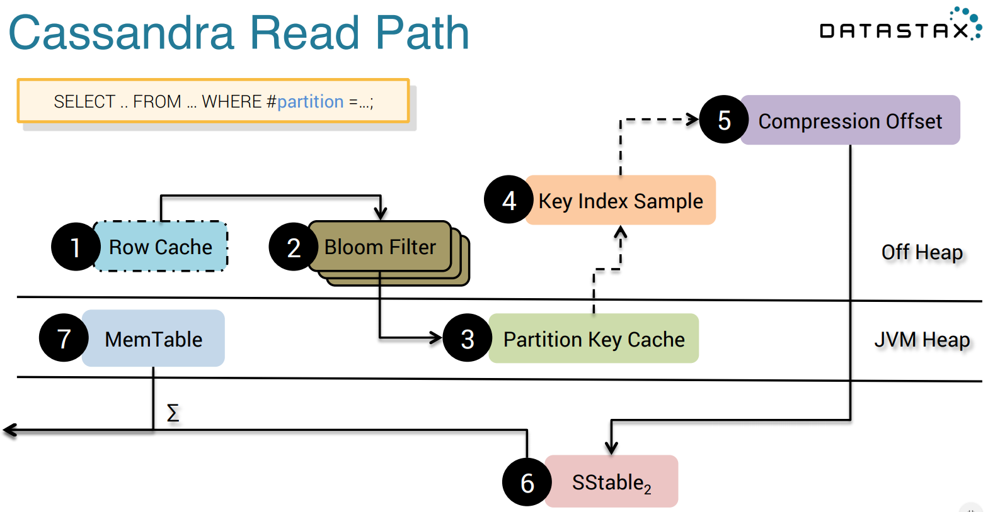

# cassandra-learning
This is a repository for learning Apache Cassandra, and how it interacts with golang/gocql

# Running experiments 
First of all, you need to run a running cassandra container: `make start-cassandra`

This will start a cassandra and also install the DB schema.  
You can always install schema separately with `make install-schema`

## Running tests

Experiments could be launched manually with tests:
explore `pkg/myjournal/myjournal_test.go`

## CLI Application

The project includes a CLI tool for managing journal posts. The CLI provides commands to create and read posts.

### Building the CLI

Use `make bins` to compile the `./myjournal-cli` CLI.

```bash
# Using make
./myjournal-cli create --user-id 10000000-1000-f000-f000-000000000000 --title "My Post" --body "Post content" --tags "tag1,tag2"
./myjournal-cli read --user-id 10000000-1000-f000-f000-000000000000 # show all posts for a user
```

These commands also log the CQL queries to the console if `cassandra.log_queries` is set to `true` in the config file.

## Experimenting with cqlsh
Tons of experiments could be done with cqlsh.  
Just login to the cassandra container by `docker exec -it cassandra bash`, it has `cqlsh` installed.

## Useful commands
Here I'll just list some useful commands:
```aiignore
USE myjournal;
DESCRIBE myjournal; # to see the schema of tables and user-defined-types (UDT)
SELECT * FROM myjournal;

UPDATE posts_by_user SET tags = tags + {'tag3'} WHERE user_id=10000000-1000-f000-f000-000000000000 AND post_id=65a6c636-9c54-11f0-b159-b2d8528c96f8;
INSERT INTO posts_by_user (user_id, post_id, post) VALUES(10000000-1000-f000-f000-000000000000, c1c96b18-9c53-11f0-9bcc-b2d8528c96f8, {title: null, body: null}) IF NOT EXISTS; # uses LWT for IF NOT EXISTS

TRACING ON; # enables tracing of every query. You can see what's exacly is happening in the DB.
TRACING OFF; # disables tracing.

ALTER TABLE myjournal.posts_by_user WITH compression = {'enabled': 'false'}; # disables compression. Most probably it is LZ4 by default.
```

Use this commands to expore SSTables:
```bash
export PATH=$PATH:/opt/cassandra/tools/bin/
cd /opt/cassandra/data/data/myjournal/posts_by_user-XXX # there should be at least one directory
sstabledump nb-1-big-Data.db # explore a single sstable
sstablemetadata nb-1-big-Data.db # show metadata (incl compressoin, partition size, etc)
```

The following commands are interacting with the Cassandra node: 
```bash
nodetool compact myjournal # call compaction of myjournal keyspace. As the result there will be a single sstable
nodetool flush myjournal # flush memtable of myjournal keyspace
```

# Cassanrda read-path recap

Want to refresh how Cassanrda performs query? Here is a digram:  


Here is a diagram from Datastax showing what's in memory.  

